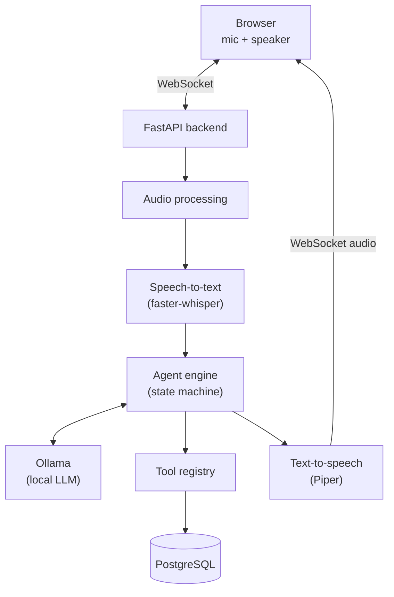

# VoiceOps

Real-time voice AI support agent for a fictional dental clinic. Speak to it
through the browser; it transcribes you locally, reasons with a local LLM,
calls real backend tools against a real database (checks availability, books
appointments, looks up customers, answers policy questions), and talks back
— entirely on your machine, at $0 recurring cost.

> **Status:** Phase 1 of 13 (repo structure + tooling) is complete. See
> [PROJECT.md](PROJECT.md) for the live build log and what's implemented so
> far. Sections below describe the target system; anything not yet built is
> marked accordingly.

## Architecture



All business logic lives on the backend. The browser only ever talks to
FastAPI over a WebSocket — never directly to the database or the LLM.

## Tech stack

| Layer | Choice | Why |
|---|---|---|
| Backend | Python 3.12, FastAPI, WebSockets | async-native, typed, fast to iterate |
| STT | faster-whisper | local, no API cost, good latency on Apple Silicon |
| LLM | Ollama | local model serving, structured tool calling |
| TTS | Piper | local, fast, no API cost |
| DB | PostgreSQL | relational integrity for appointments/customers, full-text search for the KB |
| Frontend | Next.js, TypeScript, React, Tailwind CSS | typed, modern, fast dev loop |
| Package managers | `uv` (backend), `npm` (frontend) | already-installed, lockfile-based |

No paid APIs (OpenAI, Anthropic, Twilio, ElevenLabs, Deepgram, etc.) are used
anywhere in this project — everything runs locally.

## Repository layout

```
backend/
    app/
        main.py            FastAPI app + lifespan
        api/                websocket.py, conversations.py, appointments.py (Phase 5+)
        agent/               conversation state machine, LLM orchestration (Phase 4)
        voice/                STT/TTS/audio abstractions (Phase 6-7)
        tools/                appointments, customers, knowledge, notifications (Phase 3)
        db/                   models, repositories, migrations (done)
        services/             conversation + summary orchestration (Phase 4/11)
        core/                 config.py, logging.py (done)
    tests/
frontend/
    src/app/                Next.js App Router dashboard (Phase 10)
docker-compose.yml          postgres for local dev
.env.example
Makefile
```

## Local setup

### Prerequisites

- Python via [`uv`](https://docs.astral.sh/uv/) (already manages its own interpreter — no system Python needed)
- Node.js + npm
- PostgreSQL 16 — native via Homebrew (recommended, see below) or Docker
- [Ollama](https://ollama.com) — install with `brew install ollama`, then `ollama serve`
- [Piper](https://github.com/rhasspy/piper) TTS — install with `pip install piper-tts` (or download a prebuilt binary from the Piper releases page); download a voice model (e.g. `en_US-lessac-medium`) into `voice-models/piper/`
- faster-whisper is a Python dependency installed with the backend (Phase 6) — no separate install needed

### 1. Install Ollama and pull a model

```bash
brew install ollama
ollama serve &
ollama pull llama3.1:8b   # or a smaller model — see OLLAMA_MODEL below
```

`OLLAMA_MODEL` in `.env` controls which model the agent uses — change it to
whatever fits your machine (e.g. `llama3.1:8b`, `qwen2.5:7b`, `phi3.5`).

### 2. Start Postgres

Native via Homebrew (recommended — no Docker Desktop GUI/permission prompt
needed):

```bash
brew install postgresql@16
brew services start postgresql@16
psql -U "$(whoami)" -d postgres -c "CREATE ROLE voiceops LOGIN PASSWORD 'voiceops';"
psql -U "$(whoami)" -d postgres -c "CREATE DATABASE voiceops OWNER voiceops;"
cp .env.example .env
```

Or, if you prefer Docker (`docker-compose.yml` defines the same Postgres
service):

```bash
cp .env.example .env
docker compose up -d postgres
```

### 3. Backend

```bash
cd backend
uv sync
uv run alembic upgrade head       # create schema
uv run python -m app.db.seed      # seed the fictional clinic (idempotent)
uv run uvicorn app.main:app --reload --port 8000
# → http://localhost:8000/health
```

For tests, also create a `voiceops_test` database (same role):
`psql -U "$(whoami)" -d postgres -c "CREATE DATABASE voiceops_test OWNER voiceops;"`
— `tests/conftest.py` creates/drops its schema automatically each test run.

### 4. Frontend

```bash
cd frontend
npm install
npm run dev
# → http://localhost:3000
```

Or from the repo root: `make install`, `make dev-backend`, `make dev-frontend`.

## Example conversation

*(Target behavior — full pipeline lands in Phase 8.)*

```
User:  Hi, I'd like to book an appointment for Friday afternoon.
       I've been having tooth pain.
Agent: I'm sorry to hear that. What's your name so I can look up your file?
User:  John Smith.
Agent: Thanks, John. I have an opening Friday at 2:30 PM for a general
       checkup — would you like me to book that?
User:  Yes, please.
Agent: You're booked for Friday at 2:30 PM. You'll get a confirmation.
       Anything else?
```

## Architecture decisions

- **Business logic never leaves the backend.** The browser only exchanges
  WebSocket messages with FastAPI; the LLM and DB are unreachable from the
  client. See the WebSocket protocol doc (Phase 5) for the message schema.
- **No vector database.** The knowledge base is small and fixed (clinic
  policies); PostgreSQL full-text search is sufficient and keeps the stack
  simple (Phase 3).
- **No Redis (yet).** Conversation state is persisted in Postgres and the
  backend runs as a single process, so there's no cross-process cache or
  queue to justify it. Revisit if a real need shows up (e.g. multi-worker
  deployment needing shared session state).
- **Ollama/Piper run on the host, not in Docker.** Simplifies Apple Silicon
  GPU/Metal access for local inference and avoids audio-device passthrough
  into a container. Postgres is containerized since it has no such
  dependency.
- **`uv` for the backend, `npm` for the frontend.** Both are already
  installed and are each ecosystem's standard, lockfile-based tool.

## Known limitations

- True low-latency streaming interruption (stopping TTS mid-sentence the
  instant the user's voice is detected) is constrained by local-model
  latency; the implementation and its tradeoffs will be documented in
  Phase 9.
- Single-process backend: no horizontal scaling story (out of scope for a
  portfolio project).

## Testing

```bash
make test   # backend: pytest
make lint   # backend: ruff + mypy, frontend: eslint
```

## Development process

This project is being built in 13 phases (see the original spec in
[PROJECT.md](PROJECT.md)); each phase lands with passing tests/lint and a
commit before the next begins.
