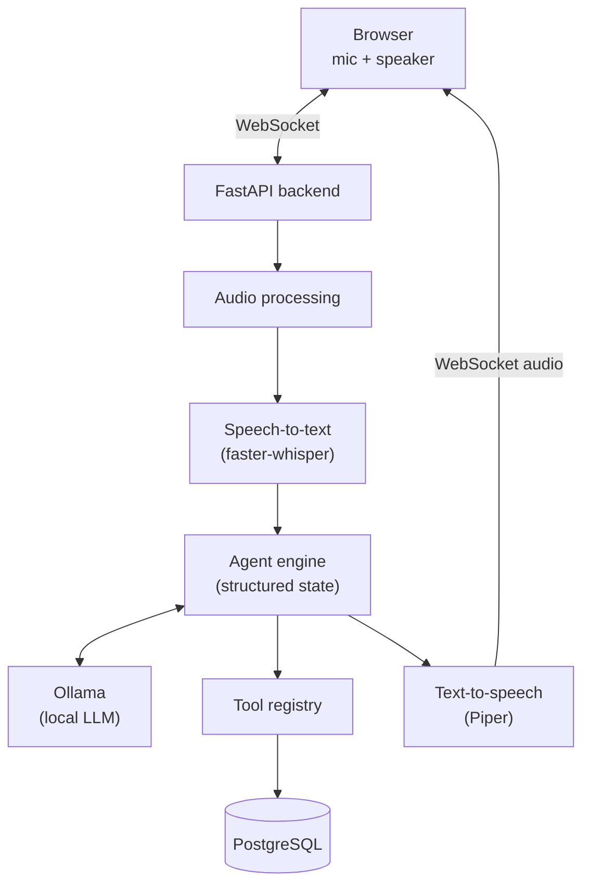

# FrontDesk Voice AI

Real-time voice AI support agent for a fictional dental clinic. Speak to it
through the browser; it transcribes you locally, reasons with a local LLM,
calls real backend tools against a real database (checks availability, books
appointments, looks up customers, answers policy questions), and talks back
— entirely on your machine, at $0 recurring cost.

> **Status:** 11 of 13 build phases complete — the full pipeline (WebSocket
> → STT → agent → tool calling → DB → TTS) is real and has been
> live-verified end-to-end against a running Postgres + Ollama instance,
> not just mocks. Docker Compose for the app containers is written but
> unverified (no local Docker install to test against — see
> [PROJECT.md](PROJECT.md)). See PROJECT.md for the full build log,
> decisions, and what remains.

## Architecture



All business logic lives on the backend. The browser only ever talks to
FastAPI over a WebSocket — never directly to the database or the LLM. The
full message protocol is documented in the docstring at the top of
`backend/app/api/websocket.py`.

## Tech stack

| Layer | Choice | Why |
|---|---|---|
| Backend | Python 3.12, FastAPI, WebSockets | async-native, typed, fast to iterate |
| STT | faster-whisper | local, no API cost, good latency on Apple Silicon |
| LLM | Ollama | local model serving, structured tool calling |
| TTS | Piper | local, fast, no API cost |
| DB | PostgreSQL | relational integrity for appointments/customers, full-text search for the KB |
| Frontend | Next.js, TypeScript, React, Tailwind CSS | typed, modern, fast dev loop |
| Package managers | `uv` (backend), `npm` (frontend) | already-installed, lockfile-based |

No paid APIs (OpenAI, Anthropic, Twilio, ElevenLabs, Deepgram, etc.) are used
anywhere in this project — everything runs locally.

## Repository layout

```
backend/
    app/
        main.py            FastAPI app + lifespan, wires every router
        api/                 websocket.py (real-time protocol), conversations.py (debug timeline REST)
        agent/                state.py, prompts.py, llm_provider.py, agent.py, tool_registry.py
        voice/                stt.py (faster-whisper), tts.py (Piper CLI), audio.py
        tools/                appointments, customers, knowledge, notifications — 8 tools
        db/                   models, repositories, migrations, seed data
        services/             summary_service.py (call summaries)
        core/                 config.py, logging.py
    tests/                 41 tests across 8 files
    Dockerfile             unverified — see Docker section below
frontend/
    src/
        app/                 dashboard (page.tsx) + debug/[conversationId]/ timeline page
        components/          Header, ConversationPanel, VoiceControls, Waveform, AgentStateIndicator, ToolActivityPanel, CallSummaryPanel
        lib/                 protocol.ts (wire types), audio.ts, useConversationSocket.ts (the core hook)
    Dockerfile             unverified — see Docker section below
docker-compose.yml         postgres (verified) + backend/frontend (unverified)
.env.example
Makefile
```

## Local setup

### Prerequisites

- Python via [`uv`](https://docs.astral.sh/uv/) (already manages its own interpreter — no system Python needed)
- Node.js + npm
- PostgreSQL 16 — native via Homebrew (recommended, see below) or Docker
- [Ollama](https://ollama.com) — install with `brew install ollama`, then `ollama serve`
- [Piper](https://github.com/rhasspy/piper) TTS — install with `pip install piper-tts` (or download a prebuilt binary from the Piper releases page); download a voice model (e.g. `en_US-lessac-medium`) into `voice-models/piper/`. **Not installed in the reference dev environment** — the app degrades gracefully to text-only without it (verified), but actual speech synthesis is unverified until you install it.
- faster-whisper is a Python dependency installed with the backend — no separate install needed (downloads its model on first use)

### 1. Install Ollama and pull a model

```bash
brew install ollama
brew services start ollama
ollama pull llama3.1:8b   # or a smaller/larger model — see OLLAMA_MODEL below
```

`OLLAMA_MODEL` in `.env` controls which model the agent uses. Note: smaller
models are less reliable at multi-step tool orchestration (see Known
limitations) — `llama3.1:8b` sometimes loops on a tool call instead of
completing a booking. A larger or more tool-tuned model will likely do
better.

### 2. Start Postgres

Native via Homebrew (recommended — no Docker Desktop GUI/permission prompt
needed):

```bash
brew install postgresql@16
brew services start postgresql@16
psql -U "$(whoami)" -d postgres -c "CREATE ROLE voiceops LOGIN PASSWORD 'voiceops';"
psql -U "$(whoami)" -d postgres -c "CREATE DATABASE voiceops OWNER voiceops;"
psql -U "$(whoami)" -d postgres -c "CREATE DATABASE voiceops_test OWNER voiceops;"  # for the test suite
cp .env.example .env
```

Or, if you prefer Docker (`docker-compose.yml` defines the same Postgres
service):

```bash
cp .env.example .env
docker compose up -d postgres
```

### 3. Backend

```bash
cd backend
uv sync
uv run alembic upgrade head       # create schema
uv run python -m app.db.seed      # seed the fictional clinic (idempotent)
uv run uvicorn app.main:app --reload --port 8000
# → http://localhost:8000/health
```

### 4. Frontend

```bash
cd frontend
npm install
npm run dev
# → http://localhost:3000
```

The frontend's `NEXT_PUBLIC_WS_URL`/`NEXT_PUBLIC_API_URL` default to
`localhost:8000` in code, matching the backend defaults above — no `.env`
needed unless you're pointing at a different backend host. If you do,
create `frontend/.env.local` (Next.js reads env files from `frontend/`,
not the repo root) with those two vars.

Or from the repo root: `make install`, `make dev-backend`, `make dev-frontend`.

### Try it

Open `http://localhost:3000`, click **Start Conversation**, allow
microphone access, and talk — or use the WebSocket protocol directly with
`user_text` messages if you'd rather not use a mic. Click **View debug
timeline** in the sidebar once a conversation starts to see the
per-message/tool-call event log.

## Docker

`docker-compose.yml` now defines all three services — `postgres`
(verified, this is the primary way Postgres runs even in local/native
dev), `backend`, and `frontend` (both **unverified** — written without a
local Docker install to test `docker build`/`docker compose up` against).
Ollama and Piper still run on the host in every configuration — see
Architecture decisions below for why.

```bash
cp .env.example .env
docker compose up --build
# or: make docker-up
```

If you hit build issues, they're most likely in `backend/Dockerfile` (the
`faster-whisper`/`ctranslate2` dependency chain has native components that
weren't tested against the `python:3.12-slim` base image used here) or
`OLLAMA_HOST=http://host.docker.internal:11434` not resolving on your
platform (the compose file adds `host-gateway` for Linux, but this is
also unverified). Native/local dev (`make dev-backend` + `make
dev-frontend`) is the proven path — reach for Docker once you've confirmed
these work.

## Example conversation

Captured from a real run against `llama3.1:8b` and the live pipeline
(lightly trimmed):

```
User:  Hi, what are your opening hours?
Agent: [calls search_knowledge_base("opening hours")]
Agent: We're open Monday through Friday from 9:00 AM to 5:00 PM.
       We're closed on weekends and major holidays.
```

A booking flow (also real, though smaller local models don't always
complete multi-step tool sequences reliably — see Known limitations):

```
User:  Hi, my name is Jane Doe. I would like to book a cleaning for
       tomorrow afternoon.
Agent: [calls lookup_customer("Jane", "Doe")]
Agent: Hello Jane! I don't see a patient record for you yet — before I
       check availability, can I confirm your name is Jane Doe, and
       you'd like a cleaning tomorrow afternoon?
User:  Yes, please book it.
```

## Architecture decisions

- **Business logic never leaves the backend.** The browser only exchanges
  WebSocket messages with FastAPI; the LLM and DB are unreachable from the
  client. See the protocol docstring in `backend/app/api/websocket.py`.
- **No vector database.** The knowledge base is small and fixed (clinic
  policies); PostgreSQL full-text search is sufficient and keeps the stack
  simple.
- **No Redis.** Conversation state is persisted in Postgres and the
  backend runs as a single process, so there's no cross-process cache or
  queue to justify it.
- **Ollama/Piper run on the host, in every configuration — including
  Docker.** Simplifies Apple Silicon GPU/Metal access for local inference
  and avoids audio-device passthrough into a container.
- **Postgres runs natively via Homebrew for local dev, not Docker** —
  Docker Desktop's first-launch GUI permission prompt can't be automated
  in an agent-driven setup; `docker-compose.yml` remains a valid
  alternative for anyone who already has Docker running.
- **Interruption/barge-in: each turn is a cancellable `asyncio.Task`,
  and each turn owns its own DB session.** The latter isn't a style
  choice — sharing one session across cancellable concurrent work
  corrupted SQLAlchemy's async/greenlet bridge in testing (see
  PROJECT.md for the full bug writeup).
- **Tool results are sent to Ollama as role `"tool"`, not `"system"`.**
  Using `"system"` confused the chat template into echoing a literal
  `"assistant\n\n"` into its own responses — found via live testing, not
  a mocked test.
- **`uv` for the backend, `npm` for the frontend.** Both are already
  installed and are each ecosystem's standard, lockfile-based tool.

## Known limitations

- **Interruption/barge-in** is real, not simulated: each conversational
  turn runs as a cancellable `asyncio.Task`, so the server can keep
  listening while a response is in flight. When real speech (checked via
  a simple RMS threshold, not a full VAD model) arrives mid-turn, the
  in-flight task is cancelled, its uncommitted DB writes are rolled back,
  and the client immediately stops any audio it's currently playing.
  The one thing that can't be undone is frames already sent over the
  wire — once a turn's `"audio"` message has actually reached the
  browser, cancellation can't retroactively un-send it. In practice this
  means interruption is most effective during the "thinking"/
  "calling_tool" phase (most of a local LLM's latency), which is also
  where it matters most.
- **Tool-use reliability depends on the chosen Ollama model.** `llama3.1:8b`
  (an 8B model) sometimes loops on a tool (e.g., re-calling
  `lookup_customer` instead of proceeding to `create_customer`) rather
  than completing a multi-step booking flow. This is a model-capability
  limitation, not an architecture bug — verified by exercising the real
  pipeline end-to-end against live Ollama, not just mocks. A larger or
  more tool-tuned model would likely follow the flow more reliably.
- **Piper (TTS) is unverified.** It isn't installed in the reference dev
  environment. The degradation path (binary/model missing → graceful
  text-only response, no crash) is real and tested; actual speech
  synthesis has not been exercised.
- **Docker for the app containers is unverified** (see Docker section
  above) — no local Docker install to test `docker build` against.
- Single-process backend: no horizontal scaling story (out of scope for a
  portfolio project).
- Every appointment consumes exactly one 30-minute slot regardless of
  `appointment_type.duration_minutes` — no multi-slot allocation for
  longer procedures.
- Tool calls are bounded by a 10-second timeout
  (`TOOL_TIMEOUT_SECONDS`) so a hung tool can't hang a whole turn.

## Testing

```bash
make test   # backend: pytest (41 tests)
make lint   # backend: ruff + mypy, frontend: eslint
```

Tests run against a real local Postgres (`voiceops_test`), not mocks, for
the DB/repository/tool layers — the LLM and voice subsystems are mocked
in the automated suite (per the project's testing conventions), but the
whole pipeline has also been manually verified live against real Ollama
and faster-whisper (see PROJECT.md's Verification section for specifics).

## Development process

This project was built in 13 phases (see [PROJECT.md](PROJECT.md) for the
full build log); each phase landed with passing tests/lint, and most were
additionally live-verified against the real local AI stack before being
considered done, not just tested against mocks.
